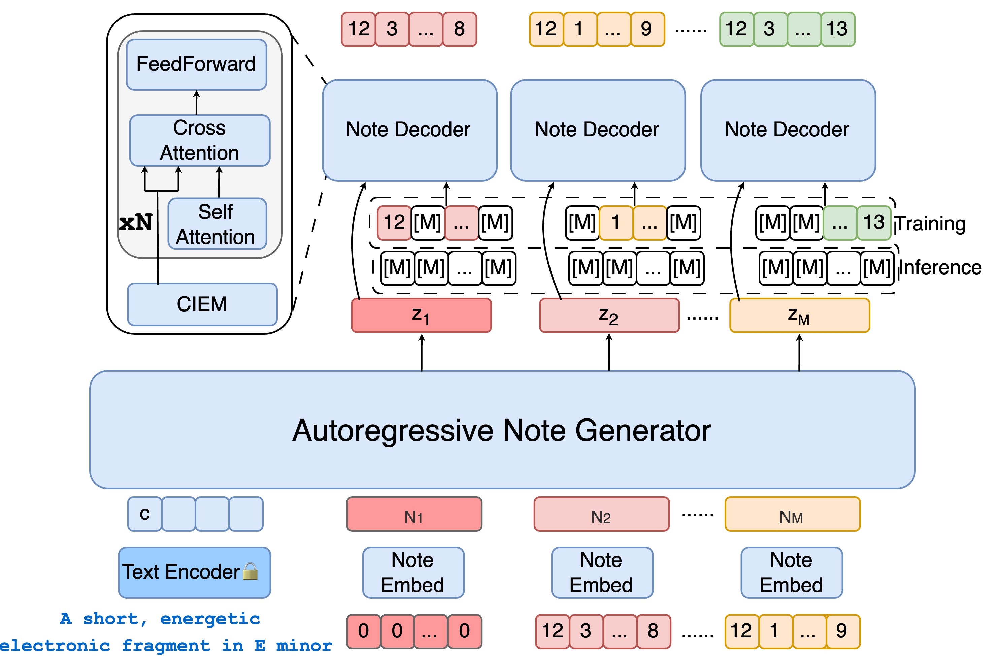

# 🎵 Amadeus: Autoregressive Model with Bidirectional Attribute Modelling for Symbolic Music

**Amadeus** is a novel **symbolic music (MIDI) generation framework**. We use **autoregressive modeling** for note sequences, **discrete diffusion models** for intra-note attributes, and **representation optimization** to enhance model performance. Compared to current mainstream autoregressive or hierarchical autoregressive models, Amadeus achieves significant improvements in **generation quality, speed, and controllability**. While significantly improving generation quality, we have achieved a speedup of at least **4x** compared to pure autoregressive models. We also support a training-free **fine-grained attribute control** mechanism, which endows Amadeus with maximum flexibility. We will continuously update the **code, models, and datasets**.


***

## 🏗️ Model Architecture
<p align="center">
  
</p>


***

## 🎧 Demo

<p align="center">
  <audio controls>
    <source src="assets/exp_amadeus.mp3" type="audio/mpeg">
    Your browser does not support the audio element.
  </audio>
</p>


***

## 📅 Changelog


*   2025-08-28: Released inference code and the **Amadeus-S** model


***

## ⚙️ Installation and Usage

Set up the environment (inference only):


```bash
conda create -n amadeus_slim python=3.10

conda activate amadeus_slim

pip install -r demo/requirements.txt
```

First run:


```bash
# Chinese interface

python demo/Amadeus\_app\_CN.py

# English interface

python demo/Amadeus\_app\_EN.py
```

> Note: 
>
> `Amadeus_app_CN.py`
>
>  is for the Chinese interface, and 
>
> `Amadeus_app_EN.py`
>
>  is for the English interface.

👉 The model will be automatically downloaded to the `models/` folder, which includes a usable **soundfont**. Please modify the path of `DEFAULT_SOUND_FONT` in `Amadeus/symbolic_encoding/``midi2audio.py`.

Example of command-line generation:


```
python generate.py -wandb\_exp\_dir models/Amadeus-S -text\_encoder\_model google/flan-t5-base -temperature 2 -prompt "A lively and melodic pop rock song featuring piano, overdriven guitar, electric drum and electric bass, set in a fast 4/4 tempo and the key of C# minor, with a frequently recurring chord progression of D, A, C#m, and F# that evokes a mix of emotion and love."
```


***

## 📂 Repository Structure


```
Amadeus/

├── demo/                   # Example scripts and interfaces (CN/EN)

├── Amadeus/                # Core model and symbolic encoding

├── assets/                 # Architecture diagrams and sample audio files

├── data\_representation     # Data processing

├── models/                 # Downloaded or cached pre-trained models

└── generate.py             # Command-line generation entry point
```


***

## 📊 Evaluation Results

We evaluated **generation speed, text alignment, and note attribute control accuracy** on the **MidiCaps** dataset. The results are as follows:


| Model          | Speed (notes/s) | CLAP ↑   | TBT ↑     | CK ↑      | CTS ↑     | CI ↑      | CMtop3 ↑  |
| -------------- | --------------- | -------- | --------- | --------- | --------- | --------- | --------- |
| Text2Midi      | 4.02            | 0.19     | 31.76     | 22.22     | 84.15     | 19.92     | 60.57     |
| MuseCoco       | 1.67            | 0.19     | 34.21     | 14.66     | 94.24     | 22.42     | 38.18     |
| T2M-inferalign | 4.02            | 0.20     | 39.32     | 29.80     | 84.32     | 20.13     | 47.74     |
| **Amadeus**    | **16.23**       | 0.20     | 73.93     | 39.31     | 96.98     | 26.01     | 65.52     |
| **Amadeus-M**  | 10.51           | **0.21** | **76.31** | **43.07** | **97.02** | **27.11** | **66.39** |


***

## 🤝 Acknowledgements and Contributions

The development of Amadeus is inspired by the music and AI communities, with the goal of **serving music creators, not replacing them**.

We welcome developers and researchers to contribute code or provide suggestions — please reach out to us via **Issues** or **Pull Requests**.

Part of the design of this project references [JudeJiwoo/nmt](https://github.com/JudeJiwoo/nmt), and we would like to express our gratitude here 🙏.


***

## 📚 Citation

If you find Amadeus helpful for your research or create，please cite our paper:


```bibtex
@article{su2025amadeus,
  title   = {Amadeus: Autoregressive Model with Bidirectional Attribute Modelling for Symbolic Music},
  author  = {Su, Hongju and Li, Ke and Yang, Lan and Zhang, Honggang and Song, Yi-Zhe},
  journal = {arXiv preprint arXiv:2508.20665},
  year    = {2025}
}