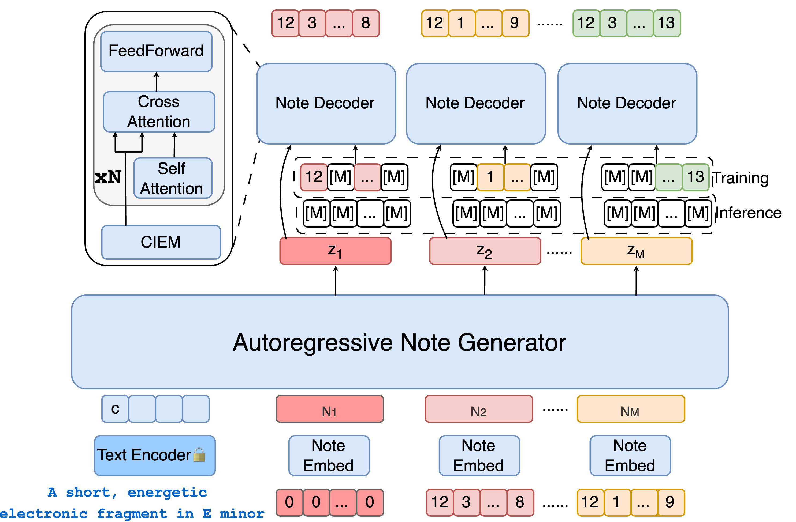

# 🎵 Amadeus: Autoregressive Model with Bidirectional Attribute Modelling for Symbolic Music
<p align="center">
  <a href="https://huggingface.co/longyu1315/Amadeus-S">
    
  </a>
  <a href="https://arxiv.org/abs/2508.20665">
    
  </a>
</p>

**Amadeus** 是一种新型的 **符号音乐 (MIDI) 生成框架**，我们使用 **自回归** 建模音符序列，**离散扩散模型** 建模音符内部属性，并通过 **表征优化** 提升模型性能。相较于当前主流的自回归或分层自回归模型，Amadeus 在 **生成质量、速度与可控性** 上均取得了显著进步。在生成质量显著提升的同时，我们实现了至少 **4x** 于纯自自回归模型的速度提升。我们同时还支持一种免训练的 **细粒度属性控制** ，这赋予了Amadeus最大程度的灵活性。我们会持续更新 **代码，模型和数据集** 。


---
## 🏗️ 模型架构
<p align="center">
  
</p>

---

## 🎧 Demo
<div style="text-align: center;">
  <audio controls>
    <source src="assets/exp_amadeus.mp3" type="audio/mpeg">
    Your browser does not support the audio element.
  </audio>
</div>

---

## 📅 更新日志
- 2025-08-28：公布推理代码和 **Amadeus-S** 模型

---

## ⚙️ 安装与使用
搭建环境（仅推理）：  
```bash
conda create -n amadeus_slim python=3.10
conda activate amadeus_slim
pip install -r demo/requirements.txt
```

首次运行：  
```bash
# 中文界面
python demo/Amadeus_app_CN.py

# 英文界面
python demo/Amadeus_app_EN.py
```
> 说明：`Amadeus_app_CN.py` 用于中文界面，`Amadeus_app_EN.py` 用于英文界面。
👉 模型会自动下载到 `models/` 文件夹，包含一个可用的 **soundfont**。请修改 `Amadeus/symbolic_encoding/midi2audio.py` 中的 `DEFAULT_SOUND_FONT` 路径。

命令行生成示例：  
```bash
python generate.py -wandb_exp_dir models/Amadeus-S -text_encoder_model google/flan-t5-base -temperature 2 -prompt "A lively and melodic pop rock song featuring piano, overdriven guitar, electric drum and electric bass, set in a fast 4/4 tempo and the key of C# minor, with a frequently recurring chord progression of D, A, C#m, and F# that evokes a mix of emotion and love."
```

---

## 📂 仓库结构
```
Amadeus/
├── demo/                   # 示例脚本与界面 (CN/EN)
├── Amadeus/                # 核心模型与符号编码
├── assets/                 # 架构图与示例音频文件
├── data_representation     # 数据处理
├── models/                 # 下载或缓存的预训练模型
└── generate.py             # 命令行生成入口
```

---

## 📊 评测结果
我们在 **MidiCaps** 数据集上评测了 **生成速度、文本对齐度以及音符属性控制精度**。结果如下：

| Model        | Speed (notes/s) | CLAP ↑ | TBT ↑ | CK ↑ | CTS ↑ | CI ↑ | CM<sub>top3</sub> ↑ |
|--------------|-----------------|--------|-------|------|-------|------|---------------------|
| Text2Midi    | 4.02            | 0.19   | 31.76 | 22.22 | 84.15 | 19.92 | 60.57 |
| MuseCoco     | 1.67            | 0.19   | 34.21 | 14.66 | 94.24 | 22.42 | 38.18 |
| T2M-inferalign | 4.02          | 0.20   | 39.32 | 29.80 | 84.32 | 20.13 | 47.74 |
| **Amadeus**  | **16.23**       | 0.20   | 73.93 | 39.31 | 96.98 | 26.01 | 65.52 |
| **Amadeus-M**| 10.51           | **0.21** | **76.31** | **43.07** | **97.02** | **27.11** | **66.39** |


---
## 🤝 致谢与贡献
Amadeus 的研发受到音乐与 AI 社区的启发，旨在 **服务音乐创作者，而非替代他们**。  
我们欢迎开发者和研究人员贡献代码或提出建议 —— 请通过 **Issues** 或 **Pull Requests** 与我们交流。  

本项目部分设计参考了 [JudeJiwoo/nmt](https://github.com/JudeJiwoo/nmt)，在此表示感谢 🙏。


---

## 📚 引用
如果您觉得 Amadeus 对您的研究或创作有帮助，请引用我们的论文：

```bibtex
@article{su2025amadeus,
  title   = {Amadeus: Autoregressive Model with Bidirectional Attribute Modelling for Symbolic Music},
  author  = {Su, Hongju and Li, Ke and Yang, Lan and Zhang, Honggang and Song, Yi-Zhe},
  journal = {arXiv preprint arXiv:2508.20665},
  year    = {2025}
}